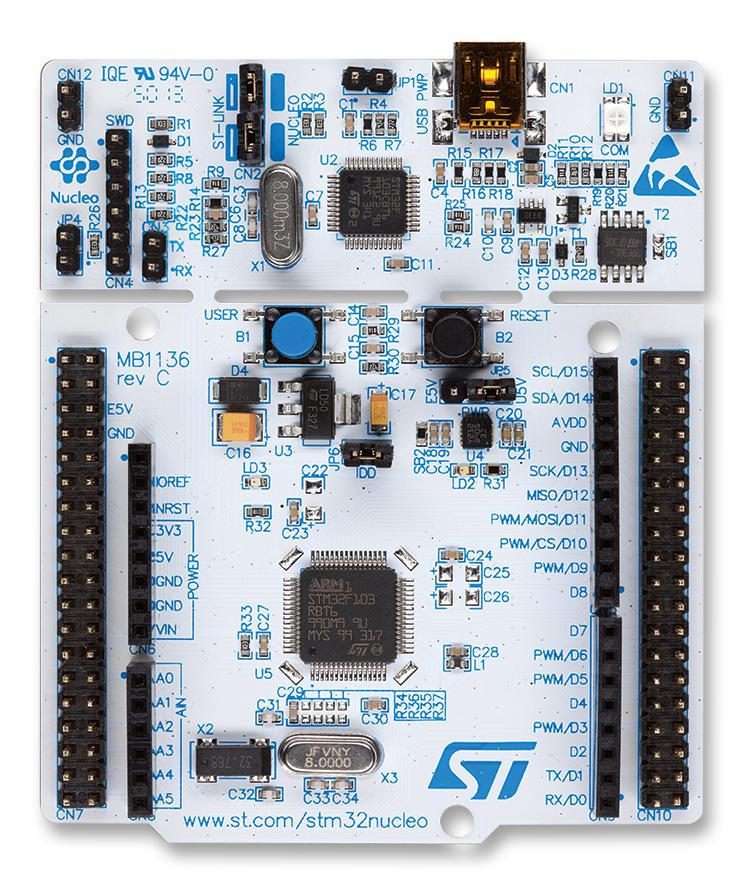
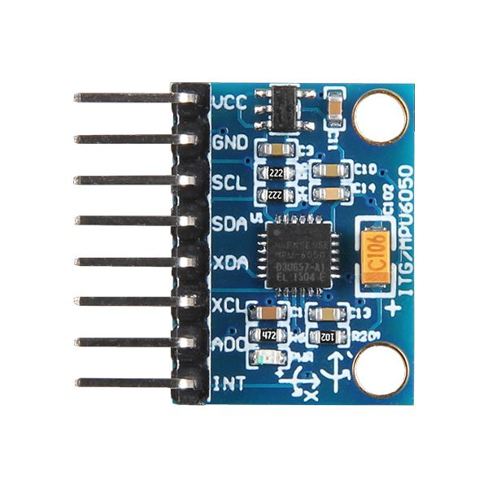
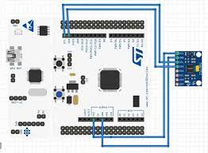

BELLIER Sacha
SICARD Antoine

# Projet de robotique

## Matériel utilisé

Pour ce projet, nous disposons d'une carte STM32 NUCLEO-F401RE ainsi que d'un capteur MPU-6050. Ce capteur est constitué d'un accélérometre et d'un gyroscope. Nous allons également utiliser le moteur de jeu Godo.

## Protocols de communications

Nous allons utiliser une communication en I2C entre le capteur MPU-6050 et la carte NUCLEO. 

Nous utiliserons de l'UART converti en usb par la carte NUCLEO pour transferer les données de la carte à l'ordinateur.

## Problématique du projet

Notre objectif pour ce projet est d'utiliser le capteur MPU-6050 pour détecter les changements d'orientation, et ainsi modifier l'orientation de la caméra dans un moteur de jeu.

## Les objectifs

Pour réaliser ce projet, nous allons faire face à plusieurs problématiques. Nous allon donc devoir résoudre plusieurs objectifs :

- Utiliser le capteur MPU-6050 pour récupérer ses données, et les traiter pour détecter les changements d'orientation et d'accélération.
- Appliquer un filtre (ex : filtre complémentaire) combinant les valeurs de l'accéléromètre et du gyroscope afin de réduire les imprécisions et le décalage de ce  dernier. 
- Transferer ces valeurs dans un moteur de jeu afin de contrôler la caméra.