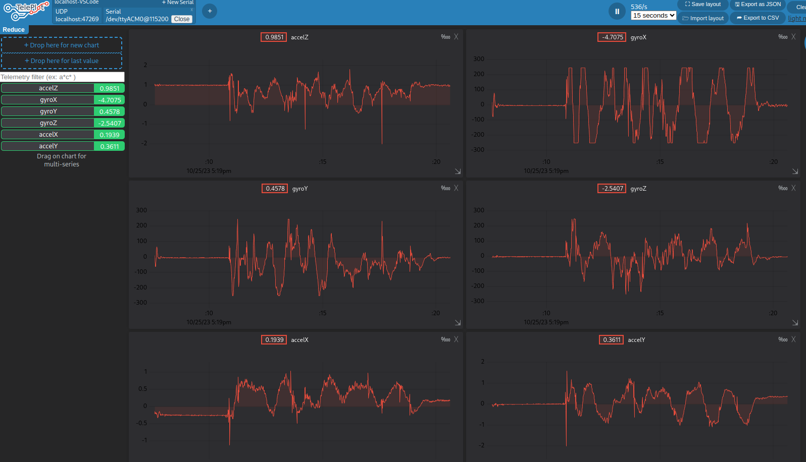

SICARD Antoine
BELLIER Sacha

# Projet Robotique

## Fin Séance 1
12/25/2023

Pour cette première séance, nous avons configuré notre projet pour lire les valeurs reçues par l'IMU. Nous appliquons tout d'abord un filtre de 44Hz puis les convertisons avec comme unitée de base g, puis nous les transmettons à la machine hôte par UART. Nous utilisons ensuite une extension de VSCode : "teleplot", qui nous permet d'afficher toutes ces valeurs sous forme de graphe en temps réel.

On remarque bien que suivant l'orientation de l'IMU, nous arrivons à obtenir des valeurs cohérentes. Par exemple, l'IMU étant à plat, nous obtenons une accélération d'environ 1 en x, et 0 en z et y.

Nous observons ici les données reçue une fois l'IMU posé à plat.

Nous pouvons également observer les valeurs de gyroscope (toujours l'IMU à l'horizontale):

Voici un résultats possible lorsque l'on bouge l'IMU.

