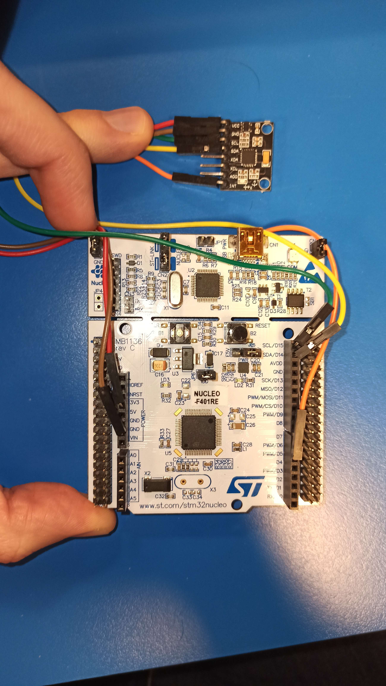
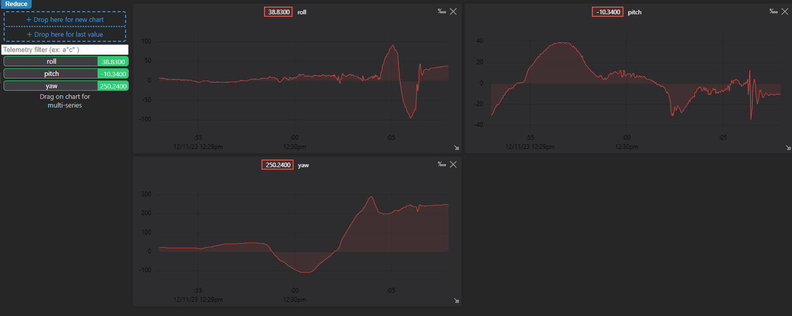
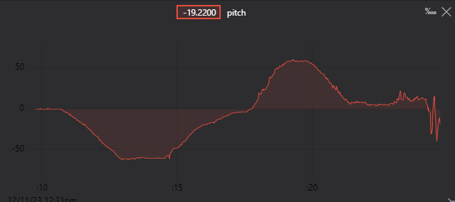
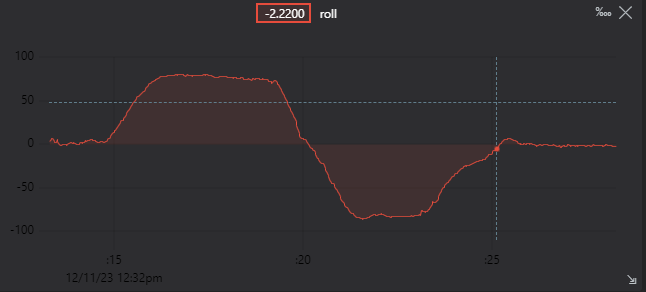

BELLIER Sacha
SICARD Antoine

# Robotique : Rapport de Projet

## Object 

L'objectif de ce projet est la maitrise d'un capteur SEN-MPU6050.

Pour ce faire, nous avons décidé d'utiliser le capteur comme contrôleur pour un moteur 3D. Celui-ci doit permettre de controler sur 3 axes la caméra du moteur 3D.

## Matériel utilisé

Pour ce projet nous utilisons donc 
- Un capteur MPU6050
- Une STM32 nucléo
- Le logiciel unity

## Branchements

Nous branchons 5 pins du capteur MPU sur la carte STM32 de la manière suivante :

|  MPU  | STM32 |         Fonction          |
|-------|-------|---------------------------|
|  Vcc  |  3.3V |    Alimenter le capteur   |
|  GND  |  GND  |      Terre du catpeur     |
|  SCL  |SCL/D15|     La Clock de l'I2C     |
|  SDA  |SDA/D14|    Transfer des données   |
|  INT  |PWM/D6 |        Interruption       |

## Fusion de capteurs

Afin d'obtenir un angle d'orientation correct et suffisament précis, nous utilisons un algorithme de [fusion de capteurs](https://en.wikipedia.org/wiki/Sensor_fusion). Il s'agit d'un processus de combinaison des différents capteurs, leur permettant de compenser leurs erreurs.

Nous utilisons ici 2 capteurs : le gyroscope et l'accéléromètre. Les données de ce dernier nous permettent de déterminer la direction et le sens du vecteur de gravité terrestre afin d'obtenir une bonne estimation de l'orientation.

L'utilisation d'un algorithme de fusion de capteurs premet de réduire l'erreur de chaque capteur :
- L'accéléromètre est très sensible aux vibrations
- Le gyroscope fournit un signal qui doit être intégré, ce qui conduit des erreurs en constante croissance au cours de l'exécution du programme.

En utilisant ces 2 capteurs, nous pouvons corriger les erreurs d'orientation :
- Accéléromètre : Correction à long terme
- Gyroscope : Correction à courts terme.

## Filtre de Kalman

L'un des algorithme de fusion de capteurs les plus populaires est le [Filtre de Kalman](https://en.wikipedia.org/wiki/Kalman_filter). Ce filtre comporte deux étapes :
- Étape de prédiction
  Cette étape est une combinaison de valeurs :
    - Les valeurs précédentes
    - Le modèle de notre système (expliquée plus bas)
  
  L'étape de prédiction est utilisée lorsque nous avons un capteur qui n'est pas rafraîchi assez souvent. L'algorithme est toujours capable de prédire les étapes si nous voulons une boucle plus rapide que celle que le capteur est capable de nous donner.

  Par exemple avec le roll. L'angle de roll actuel est le dernier angle de roll estimé avec l'ajout du roll rate.

- Étape de correction
  Cette étape consiste à appliquer des ajustements à chaque reception de nouvelles données du capteur. Avec la dernière estimation, la confiance dans cette prédiction et avec les valeurs de bruit (stockées sous forme de matrices), il corrigera les nouvelles données du capteur.

## Interagir avec l'IMU
En suivant les [spécifications](https://invensense.tdk.com/wp-content/uploads/2015/02/MPU-6000-Datasheet1.pdf) et la [Regsiter Map](https://invensense.tdk.com/wp-content/uploads/2015/02/MPU-6000-Register-Map1.pdf), nous pouvons configurer le MPU6050, avec les specification ci dessous :
- Mode de gestion d'accélération
L'Changer la fréquence d'échantillonnage
- Mode de gestion de vittesse angulaire a 250 degree/s
- Mode de gestion d'acceleration a 2 G
- Activer les interuptions
Nous utilisons le capteur en mode interruption, ce qui signifie qu'il stocke les valeurs dans son buffer interne, et nous génère une interruption.
Ainsi nous somme certain de ne rater aucune donnée, ce qui pourrait être gênant pour le filtre de Kalman par la suite.
Pour la fréquence d'échantillonnage, nous avons configuré le capteur pour qu'il échantillonne à 50Hz, les interruptions se font donc à cette fréquence.

## Implémentation du filtre
Le Filtre de Kalman a besoin de 4 valeurs en entrée, l'orientation pour le roll et pitch et la vitesse angulaire du roll et du pitch.
- Vitesse angulaire
Cette valeur est très simple à récupérer, celle-ci étant directement fournit par le gyroscope.
- L'orientation
Cette valeur est récupérée grâce à l'accéléromètre, qui détecte la force gravitationnelle terrestre. En appliquant de la simple trigonométrie sur les différents axes de l'accéléromètre nous sommes capable de déterminer l'orientation du capteur.

Notre filtre de Kalman nous permets donc de gerer `roll`, `roll rate`, `pitch` et `pitch rate`.

Commençons par expliquer les composantes de notre filtre de Kalman :
- `X` : Un Vecteur4 contenant [ roll, pitch, roll_rate, pitch_rate].
- `P` : Une matrice 4*4 qui est le niveau de confiance de l'estimation.
- `F` : Une matrice 4*4 qui contient le modèle de notre système.
Cette matrice permets de prendre en compte que le fait que roll dépends de roll et rollrate (respectivement pitch, pitch et pitch_rate).

- `Q` et `R`: 2 matrices 4*4 constantes devant être ajustées selon si l'on souhaite que le système ait plus ou moins confiance en les prédiction et les mesures. `Q` représente la confiance des prédictions et `R` la confiance des mesures.

## Yaw
Pour l'axe Yaw, nous ne pouvons pas utiliser la même technique que pour les autres axes, le vecteur de la gravité terrestre ne changeant pas en fonction du yaw de notre capteur.
Pour Yaw, on utilise alors l'intégration, ce qui donne des valeurs acceptables, surtout au début, mais on peut constater un 'drift' sur nos valeurs ce qui est gênant avec notre exemple de jeu.

Pour Yaw, on utilise alors l'integration, ce qui donne des valeurs acceptable, surtout au debut, mais on peut constater un 'drift' sur nos valeurs ce qui est genant avec notre example de jeu.

## Unity

Pour le moteur 3D, nous avons créé une siple scene 3D sur Unity. Le but n'est pas de faire un joli environnement, simplement d'avoir suffisament d'éléments pour se rendre compte des mouvements.
Les valeurs sont envoyé depuis la carte en UART, puis lus sur notre projet Unity. Un envoie UART contient les nouvelles orientations sur les 3 axes.

## Sources du projet

Les sources de notre projet sont disponibles sur [github](https://github.com/Antoine6quarts/re-beau).

# Sources
[MPU6050: product specs](https://invensense.tdk.com/wp-content/uploads/2015/02/MPU-6000-Datasheet1.pdf)
[MPU6050: register map](https://invensense.tdk.com/wp-content/uploads/2015/02/MPU-6000-Register-Map1.pdf)

[readthedocs: Kalman Filter equations](https://ahrs.readthedocs.io/en/latest/filters/ekf.html)

[Wikipedia: IMU](https://en.wikipedia.org/wiki/Inertial_measurement_unit)
[Wikipedia: MEMS](https://en.wikipedia.org/wiki/MEMS)
